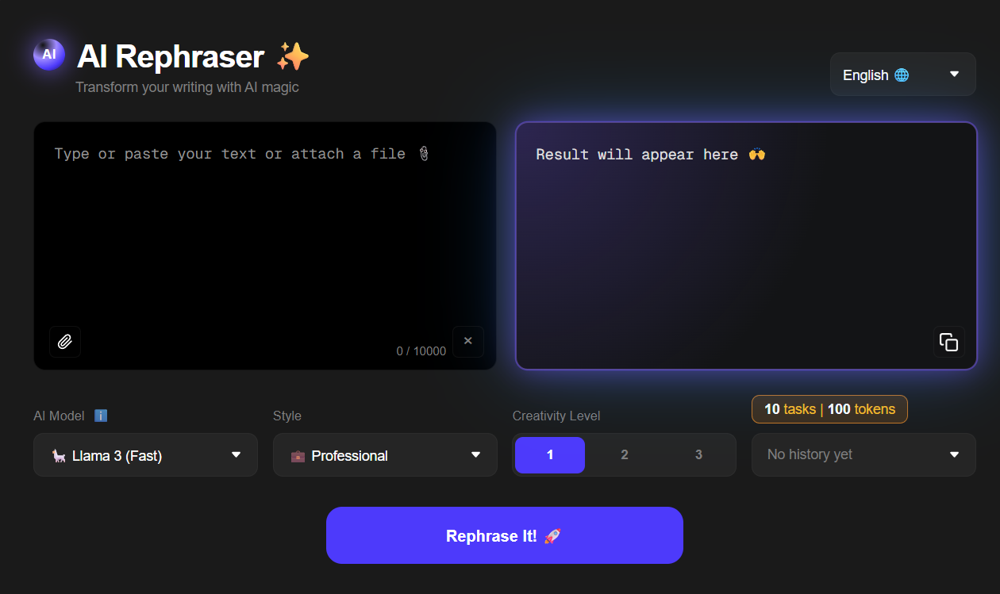

# 🖊️ AI Rephraser

> Интеллектуальный веб-сервис для перефразирования текстов с использованием современных моделей ИИ.

---

## ✨ Основные функции

- **Мультиязычность**: русский и английский интерфейс
- **Многостилевая обработка**: стандартные стили + **custom** (свой промпт)
- **Выбор AI модели**: Llama 3 (быстрый) и GPT-4o (умный)
- **3 уровня креативности**: от мягкого перефраза до глубокой переработки текста
- **Загрузка файлов**: поддержка TXT, PDF, DOC
- **Счётчик токенов**: видно сколько запросов и токенов осталось
- **История запросов**: быстрый доступ к предыдущим результатам
- **Копирование в один клик**: с визуальным подтверждением ✓
- **Адаптивный дизайн**: работает на мобильных устройствах

## 🛠️ Технологический стек

| Слой | Технологии |
|------|-----------|
| Frontend | HTML5, CSS3, JavaScript (Vanilla) |
| Backend | Python, Flask |
| AI Engine | Llama 3.3 via Groq API, GPT-4o |
| Infrastructure | GitHub Pages (client) + Render (server) |

## 🚀 Как запустить

Сервис доступен по ссылке: **[https://ai-rephraser-api.onrender.com](https://ai-rephraser-api.onrender.com)**

> ⚠️ Так как сервер использует бесплатный тариф Render, при первом запросе после простоя может потребоваться около 50 секунд для пробуждения системы.
